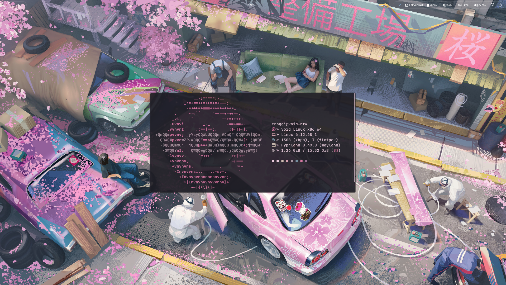
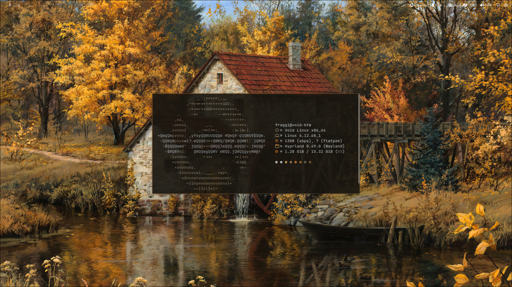
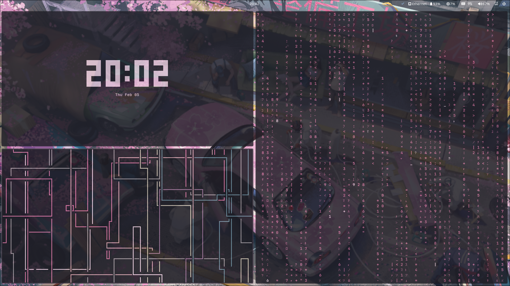

# My Hyprland Dotfiles
> My personal Dotfiles made originally for void linux

## Gallery

### Desktop Overview

### Terminal & Fetch

# Directories
hypr .config/hypr/  (here you have hyprland.conf and hyprlock.conf)

waybar .config/waybar/ (here you have the config file and the css file)

waybar scripts .config/waybar/scripts (all the waybar scripts)

wofi .config/wofi (style.css and wall.css files)

pywal .config/wal/templates (add here the color templates for hyprland and wofi) (rofi too if you use it)

Wallpapers ~/Pictures/Wallpapers 

fish .config/fish (config.fish file for the aliases etc...)

kitty .config/kitty (kitty config file)

starship .config/starship.toml (this is the config file)

# WARNING 
My waybar doesnt support modules like "network" "pulseaudio" etc.. so i made custom modules, if you're not okay with that you'll need to change the modules yourself

# Install the needed packages
sudo xbps-install -Sy waybar wofi neovim pywal swww mesa mesa-dri seatd sddm dbus xdg-desktop-portal-hyprland

# Add the Hyprland community repo
echo "repository=https://raw.githubusercontent.com/Makrennel/hyprland-void/repository-x86_64-glibc" | sudo tee /etc/xbps.d/hyprland-void.conf

# Sync and install
sudo xbps-install -S hyprland xdg-desktop-portal-hyprland

# Enable DBus, Seatd and SDDM (Required for Wayland/Hyprland)
sudo ln -s /etc/sv/dbus /var/service/
sudo ln -s /etc/sv/seatd /var/service/
sudo ln -s /etc/sv/sddm /var/service/

# Add yourself to the seatd group
sudo usermod -aG wheel disk audio video storage network kvm input dbus polkitd _seatd fuse $(whoami)

# Add the fish shell [RECOMMENDED]
(optional, i've added both the .sh scripts and .fish scripts) (if you want to use the .sh file you need to configure the path in the waybar module)

sudo xbps-install -S fish-shell
chsh -s /usr/bin/fish (changes the user shell to fish)

# STARSHIP (if you want shell customisation)
sudo xbps-install -S starship
